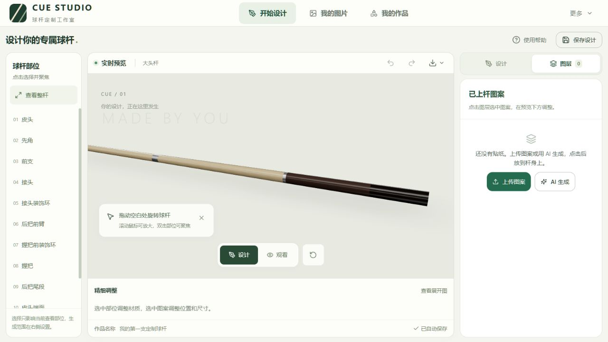

# 台球杆定制

**让灵感上杆。**

一个运行在浏览器中的台球杆外观设计工作室。上传图案或用 AI 创作，在 3D 球杆上调整材质、纹样与漆面，再导出效果图和用于水贴／转印的透明底展开 PNG。

*A browser-based cue design studio with AI artwork, real-time 3D preview, and printable wrap exports.*



## 可以做什么

- **实时看上杆效果**：按真实毫米尺寸建立球杆模型，选择部位即可聚焦；在「设计」与「观看」模式间切换，查看整体搭配和局部细节。
- **从素材库选料**：内置 40 款透明背景纹样和 30 张贴纸。纹样涵盖经典插花、中式纹样、花卉卷草和几何边饰；贴纸分为台球运动、动物萌趣和潮流徽饰。设计第二步选择「纹样选料」即可按类型搜索、分类并应用到所选部位，无需连接图片服务。
- **用 AI 设计成套纹样**：支持单部位生成，也支持前臂与尾段、主纹样与装饰环等多部位联动。联动方案共用一张风格母稿，可整套应用或只采用某个部位。
- **直接使用自己的图片**：上传素材，自动去白底，或用矩形／套索选区、擦除与恢复画笔手动剪切；蒙版保留原图，方便继续调整。
- **精细调整图案**：拖动放置，按毫米和角度调整尺寸与位置，支持旋转、翻转、透明度、图层排序、隐藏、锁定和复制。
- **搭配底材与漆面**：木纹、皮革、金属和纯色底材，配合亮光、半哑光或哑光漆面，实时查看材质表现。
- **保存与继续创作**：本地自动保存、撤销／重做、设计版本和作品归档，随时回到已有作品继续编辑。
- **导出展示与印刷文件**：分别下载带材质灯光的效果图，以及只包含印刷图层的透明 PNG；支持展开预览和导出图回贴检查。

内置纹样、上传图片、编辑和导出无需配置 AI 服务。AI 功能需要自行提供兼容的图片服务地址与密钥。

内置素材由 Codex 内置图像生成能力制作，纹样原图保存在 `public/patterns/`，贴纸原图保存在 `public/stickers/`，各目录内的 `provenance.json` 记录提示词；分类与稳定 ID 见 `src/materials/patterns.json` 和 `src/materials/stickers.json`。素材作为站点文件按需加载，不占用个人图片存储；刷新或升级时会合并图库并保留个人素材。剪切内置素材会创建个人副本，不修改系统原图。新增素材时同时更新图片、目录和提示词记录。

## 快速开始

准备 Node.js 22 与 npm，以及支持 WebGL 的浏览器。下载或克隆本仓库后，在项目目录运行：

```bash
npm ci
npm run dev
```

打开终端显示的本地地址，默认是 `http://localhost:5173`。

如果端口不可用，可以指定其他端口：

```bash
npm run dev -- --host=127.0.0.1 --port=3311
```

### 第一次设计

1. 在「开始设计」中选择球杆部位，查看当前模型和材质。
2. 上传自己的图案，或在「更多 → 服务设置」配置 AI 后描述想要的风格。
3. 将图案放到球杆上，在预览下方调整位置、尺寸与剪切结果，在右侧「图层」中管理图案。
4. 调整底材与漆面，切换「观看」检查整体效果。
5. 点击「保存设计」，之后可从「我的作品」继续编辑；通过预览区下载菜单导出效果图或工厂文件。

设计模式支持 `Ctrl / Cmd + Z` 撤销、`Ctrl / Cmd + Shift + Z` 或 `Ctrl / Cmd + Y` 重做；`Esc` 取消图案放置。

## 配置 AI 图片服务

打开「更多 → 服务设置」，填写服务商提供的连接信息：

| 配置项 | 用途 |
| --- | --- |
| 图片生成 URL | 完整的图片生成请求地址，必填 |
| 服务密钥 | 服务商提供的 API Key |
| 图片模型 | 服务商支持的模型 ID |
| 图片编辑 URL | 使用参考图或多部位联动时必填 |
| 模型查询 URL | 可选，用于查询可用模型 |
| 默认尺寸、质量、超时 | 按服务商支持的参数设置 |

**URL 必须填写完整请求地址。** 程序保留路径、尾斜杠和查询参数，不会自动追加 `/v1`、`/images/generations`、`/images/edits` 或 `/models`。

支持 OpenAI 兼容的图片生成与图片编辑接口，包括 `b64_json` 和服务扩展 `b64` 图片响应。生成地址以 `/chat/completions` 结尾时，会使用聊天请求格式并解析返回的图片；服务必须实际返回图片，纯文字回答不视为生成成功。聊天接口的图片尺寸与质量由服务商决定，参考图仍需单独配置图片编辑 URL。

- **连接检测**：配置了模型查询 URL 时发送模型查询请求；否则只向图片生成 URL 发送 `HEAD` 请求，不生成图片。仅接口可达并不代表密钥、模型和生图能力全部可用。
- **单张试生成**：使用当前填写的配置实际生成一张图片，成功后存入「我的图片」，可能产生服务商费用。
- **多部位联动**：先生成风格母稿，再通过图片编辑接口生成各部位图案。界面显示请求数量与进度，支持取消；后续请求失败时保留已完成候选。

密钥仅存放在当前标签页的 `sessionStorage` 中，不写入作品数据或导出文件。使用 AI 时，提示词和所选参考图会发送给配置的图片服务。

## 导出与实物制作

| 导出内容 | 适用场景 | 包含内容 |
| --- | --- | --- |
| 效果图 | 展示设计、沟通配色与外观 | 当前三维预览中的球杆、材质与灯光效果 |
| 透明底展开 PNG | 水贴／转印排版与试贴 | 仅印刷图层，保留透明背景与白色图案，不包含底材、灯光或辅助线 |

展开导出支持 PPI、出血、搭接、镜像和版面行宽设置，按 `像素 = 毫米 ÷ 25.4 × PPI` 计算尺寸。导出前可查看展开版面，导出后可将图片回贴到三维模型检查位置。

当前内置一种大头杆模板：总长 **1474 mm**，前支／后把各 **737 mm**，中轮直径 **21.4 mm**，大轮直径 **31.4 mm**，先角直径 **13 mm**。这些是项目指定尺寸；皮头厚度、先角长度及内部材质分段包含展示用参数。

锥面展开采用分段近似。用于实物制作前，需要按目标球杆进行 1:1 纸样试贴，校准尺寸、接缝和锥度；屏幕预览与导出文件不能替代实物校准。

## 数据保存

素材、设计、历史版本、作品和任务记录保存在当前浏览器的 **IndexedDB** 中，大图以二进制独立存储。当前版本没有账号系统或云端同步。

浏览器存储按站点来源隔离：更换浏览器、域名或端口后，不会自动带入原来的作品；清除站点数据也会删除本地设计与素材。

## 构建与部署

```bash
npm run build
npm run preview
```

构建结果位于 `dist/`，`preview` 用于本地检查构建产物。应用使用 Hash 路由。

开发服务器和本地预览已为以下供应商配置转发：

| 本地路径前缀 | 上游服务 |
| --- | --- |
| `/api/image-provider/tokenrhythm` | `https://tokenrhythm.studio` |
| `/api/image-provider/aikun` | `https://aikun.uk` |

转发保留上游路径与查询参数。其他服务地址由浏览器直接请求，需要服务商允许跨域访问。

部署 `dist/` 到静态托管时，Vite 的本地转发配置不会随构建产物运行。若使用上述供应商，需要在托管环境配置对应的转发路由。部署在子路径时，还需为 Vite 配置相应的 `base`。

## 技术栈

| 模块 | 技术 |
| --- | --- |
| 界面 | React 18、TypeScript、Tailwind CSS、Radix UI、Lucide |
| 三维渲染 | Three.js、React Three Fiber、Drei |
| 图像处理 | Canvas 2D、非破坏式蒙版 |
| 状态与存储 | Zustand、IndexedDB、idb-keyval |
| 构建与测试 | Vite、Vitest |

## 开发

```bash
npm run typecheck   # TypeScript 类型检查
npm test           # 单元测试
npm run build      # 生产构建
```

测试覆盖几何与表面映射、展开与抠图、AI 请求与任务状态、供应商转发、部位图案应用、相机和界面切换等逻辑。

```text
src/
  ai/          图片服务适配、连接检测与生成任务
  core/        类型与毫米单位约定
  cue/         杆型模板、几何、表面映射与展开
  editor/      剪切编辑器与抠图算法
  export/      展开 PNG、效果图导出与回贴检查
  materials/   材质预设、程序化纹理与漆面
  pages/       工作台、图片库、作品库、规格与设置
  state/       应用状态、编辑历史与本地持久化
  stickers/    预览与导出共用的图案合成逻辑
  three/       三维场景、拾取与相机控制
  ui/          通用组件与切换动效
  tests/       单元测试
server/
  imageProxy.ts  开发与本地预览使用的供应商转发配置
```

界面与交互修改请遵循 [项目约定](./AGENTS.md)。最初的产品规划见 [plan.md](./plan.md)，其中部分内容属于后续规划，当前能力以实现为准。

## 当前边界

- 桌面鼠标与键盘操作优先，触屏交互仍有完善空间。
- 当前只有一种内置杆型，更多规格需要新增模板与实物校准。
- AI 生成依赖外部图片服务，其接口兼容性与出图质量需使用实际配置验证。
- 当前测试以单元测试为主，浏览器端到端自动化仍待补充。
